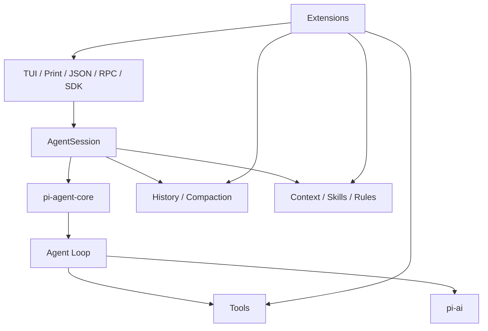
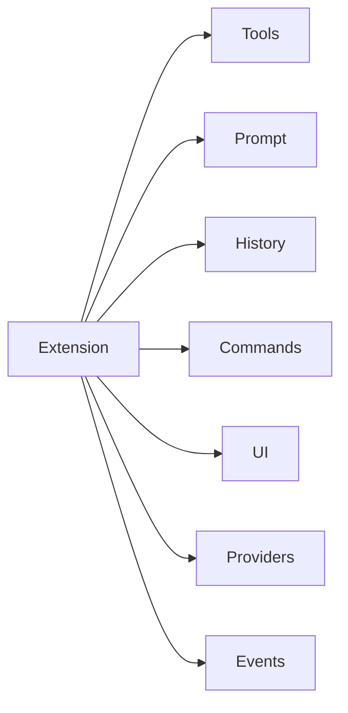

# Pi Agent Harness：架构与源码导读

> 调研时间：2026-08-15
> 官方项目：`earendil-works/pi`
> 定位：极简、强扩展、可嵌入的 coding-agent harness
> 核心关键词：Agent Loop、AgentSession、Extensions、Skills、RPC、SDK、Context Engineering

## 1. 一句话结论

Pi 最值得学习的不是“功能多”，而是它对 Agent Harness 的基本判断：

> **核心只提供最少的运行时原语，把工作流留给扩展层。**

Pi 刻意不把 subagent、plan mode、permission popup、MCP、todo、background bash 全塞进核心，而是把核心集中在：

- LLM abstraction
- Agent Loop
- Tool Calling
- Session / History
- Context Assembly
- Event Stream
- Extension API
- TUI / RPC / SDK

如果你想先搞懂“一个现代 coding agent 最少需要哪些东西”，Pi 是这四个项目里最适合先读的。

---

## 2. 仓库分层

官方仓库是 TypeScript monorepo，核心包包括：

| 包 | 作用 |
|---|---|
| `@earendil-works/pi-ai` | 多 Provider / 多模型统一 LLM API |
| `@earendil-works/pi-agent-core` | Agent runtime、tool calling、state management |
| `@earendil-works/pi-coding-agent` | 面向用户的 coding agent CLI / SDK |
| `@earendil-works/pi-tui` | Terminal UI |
| `@earendil-works/pi-telemetry` | telemetry contract |

整体可以理解成：



Pi 的层数相对少，读源码时比较容易看见真正的 Agent 主干。

---

## 3. Agent Loop

最值得直接看的源码入口：

```text
packages/agent/src/agent-loop.ts
```

核心过程本质上仍然是：

```text
用户输入
  ↓
写入 AgentContext
  ↓
组装 system prompt + history + tools
  ↓
调用 LLM stream
  ↓
assistant response
  ├─ text / thinking
  └─ toolCall
       ↓
     执行工具
       ↓
     toolResult 写回 context
       ↓
     再次请求 LLM
  ↓
stop / error / abort
```

源码对外暴露的关键概念包括：

```ts
agentLoop(...)
agentLoopContinue(...)
runAgentLoop(...)
```

### 读 Agent Loop 时重点看什么

不要只盯着循环本身，而要研究：

1. 用户消息什么时候正式进入 context
2. Tool result 如何重新进入模型消息流
3. Streaming delta 怎么被 UI 订阅
4. AbortSignal 怎么一路向下传
5. Retry / continue 如何避免重复追加消息
6. 模型、tool、session、UI 如何解耦

这些工程细节才是 coding agent 和普通聊天机器人的真正差异。

---

## 4. AgentSession：应用层边界

Pi 的 SDK 很值得研究。典型创建方式：

```ts
const { session } = await createAgentSession({
  model,
  tools: ["read", "bash"],
  sessionManager: SessionManager.inMemory(),
})
```

`AgentSession` 负责：

- agent lifecycle
- message history
- model state
- compaction
- event streaming
- session persistence
- tree navigation
- steering / follow-up

代表性接口：

```ts
session.prompt(...)
session.steer(...)
session.followUp(...)
session.subscribe(...)
session.setModel(...)
session.compact(...)
session.navigateTree(...)
```

这形成了一个很好的边界：

```text
UI / App
   ↓
AgentSession
   ↓
Agent Runtime
   ↓
LLM + Tools
```

你以后自己做浏览器写作 Agent、IDE Agent，也非常适合用这一层次。

---

## 5. `steer` 与 `followUp`

Pi 有两个很实用的交互原语。

### steer

Agent 还在执行时，用户可以插入一条新消息。语义接近：

```text
当前 tool 执行完
→ 中断剩余动作
→ 把 steering message 交给 Agent
→ Agent 改变方向
```

### followUp

把消息排队：

```text
当前任务完整结束
→ 再处理 follow-up
```

这两个机制特别适合真实交互式 Agent，因为用户不可能永远等 Agent 完全做完才补充要求。

---

## 6. Context Engineering

Pi 很强调“上下文是可编程的”。

### AGENTS.md

用于项目级规则，例如：

```md
- 使用 pnpm
- 修改 schema 后必须跑 migration
- generated/ 禁止手改
- 单测命令是 pnpm test
```

### SYSTEM.md

允许替换或追加项目 system prompt。

### Skills

Skill 采用按需加载，而不是把所有能力全文都塞进 prompt：

```text
只暴露 skill 概要
      ↓
任务命中时再加载具体 SKILL 内容
```

这是一种 progressive disclosure，可以减少 context 污染和 token 成本。

### Compaction

上下文接近窗口限制时自动摘要旧消息，而且 compaction 本身也可以扩展，例如：

- code-aware summary
- topic-based summary
- 使用便宜模型压缩
- 把长期信息外置到 memory

---

## 7. Session / Tree History

Pi 的用户层强调 tree-structured session。

普通聊天：

```text
A → B → C → D
```

Pi 更像：

```text
A
└─ B
   ├─ C
   │  └─ D
   └─ C2
      └─ D2
```

你可以回到历史节点，再从那里开启新的执行分支。

对 Agent 很有价值，因为软件任务经常是：

```text
方案 A → 失败
回退
方案 B → 成功
```

而不是永远一条线。

> 注意：Pi 在 2026 年仍快速迭代，底层 harness/session abstraction 最近也持续变化。学习时重点看其设计边界，不要把某个内部 backend API 名字当成稳定 ABI。

---

## 8. Extension System

Pi 的“真正灵魂”是 extension。

Extension 能扩展：

- tools
- slash commands
- key bindings
- lifecycle events
- prompt
- history transform
- model provider
- UI
- status bar / overlay
- compaction
- RAG
- memory

概念上：



而且支持热重载思路，所以很适合拿来做 Agent Harness 实验。

---

## 9. 为什么 Pi 故意不内置很多能力

官方明确强调它默认不内置：

- MCP
- subagents
- permission popups
- plan mode
- todos
- background bash

这不是“做不到”，而是哲学：

```text
Feature-heavy Agent:
Core = Loop + Plan + Todo + MCP + Subagent + Permission + ...

Pi:
Core = Primitives
     + Extension Composition
```

优点：

- 核心容易理解
- 容易 fork
- 容易 embed
- 容易拿来做研究

代价：

- 开箱即用不如 Grok Build
- 安全策略需要你自己组合
- multi-agent 需要额外设计

---

## 10. RPC / SDK

Pi 有四种典型运行形式：

1. Interactive
2. Print / JSON
3. RPC
4. SDK

因此它不是“只能在终端里用的工具”，也可以是其他应用的 Agent Runtime：

```text
你的 Web / IDE App
       ↓
Pi SDK / RPC
       ↓
AgentSession
       ↓
Agent Core
```

例如浏览器写作 Agent 可以给 Pi 提供：

```text
read_selection
replace_selection
insert_formula
search_document
publish_document
```

工具，底层 loop 完全不用知道这是“代码编辑器”还是“文章编辑器”。

---

## 11. 优点

- 最小核心非常适合学习 Agent 基本骨架
- 多模型 Provider 与 Agent Loop 解耦
- Extension 不仅能加 tool，还能改 context / history / UI
- SDK / RPC 很适合作为嵌入式 runtime
- Skills + compaction 的 context engineering 思路清晰

## 12. 缺点

- 很多高级功能需要自己组
- 自由度高意味着团队需要自己规定 extension conventions
- 默认进程权限就是启动用户权限，高权限场景需要额外 container / sandbox / allowlist

---

## 13. 推荐阅读顺序

### 第一阶段：最小闭环

```text
packages/agent/src/agent-loop.ts
packages/agent/src/types.ts
```

目标：自己能写一个极简 Agent Loop。

### 第二阶段：模型抽象

```text
packages/ai/
```

重点理解：

- provider adapter
- streaming
- tool-call schema
- reasoning blocks
- usage accounting

### 第三阶段：AgentSession

```text
packages/coding-agent/
```

看：

- session lifecycle
- compaction
- steering
- history
- event propagation

### 第四阶段：Extensions

```text
packages/coding-agent/docs/extensions.md
packages/coding-agent/examples/extensions/
```

---

## 14. 最值得借鉴的三个设计

### 1. 用 AgentSession 隔离 UI 与 Runtime

UI 不直接操纵 Agent Loop。

### 2. Context 是可编程对象

```text
instructions
skills
memory
history transforms
dynamic context
```

都不应该写死。

### 3. Core 提供 primitives，Workflow 放扩展层

核心可以只保留：

```text
Model
Context
Loop
Tool
Session
Event
```

而把：

```text
Planner
Reviewer
Subagent
MCP
Todo
Workflow
```

做成扩展。

---

## 15. 总结

> **Pi 是这四个项目里最适合学习 Agent Harness 基本功的项目。**

它让你最容易看清：

```text
LLM
+ Context
+ Agent Loop
+ Tools
+ Session
+ Events
+ Extensions
= Modern Agent Harness
```

## 官方资料

- https://pi.dev/
- https://github.com/earendil-works/pi
- https://github.com/earendil-works/pi/blob/main/packages/agent/src/agent-loop.ts
- https://github.com/earendil-works/pi/blob/main/packages/coding-agent/docs/sdk.md
- https://github.com/earendil-works/pi/blob/main/packages/coding-agent/docs/extensions.md
- https://github.com/earendil-works/pi/blob/main/packages/coding-agent/docs/session-format.md
