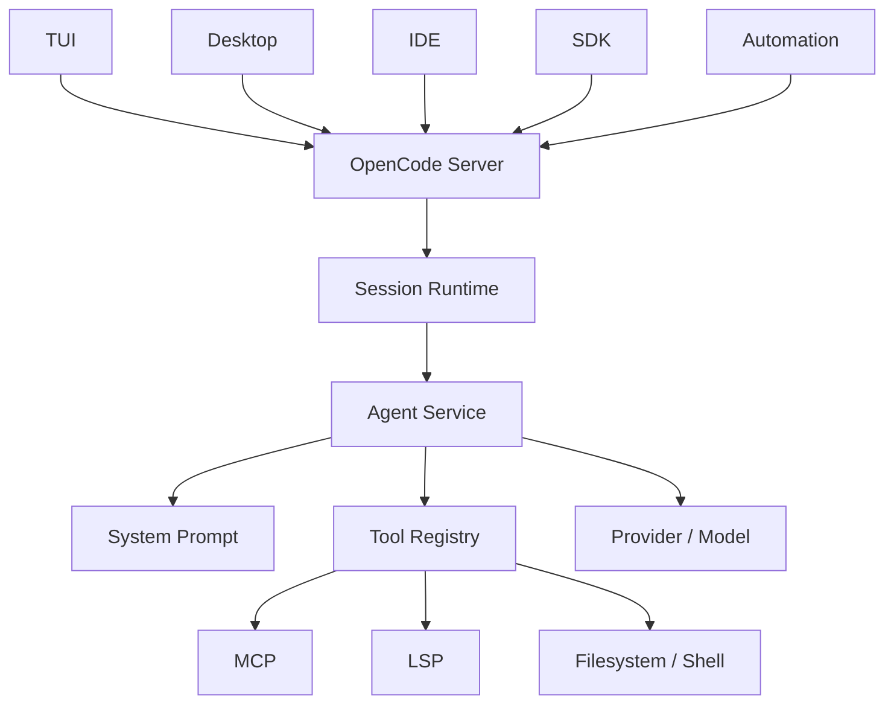
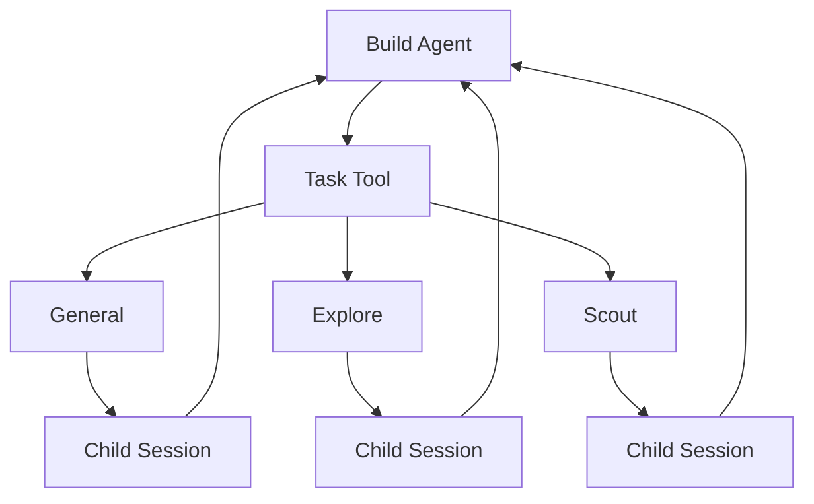
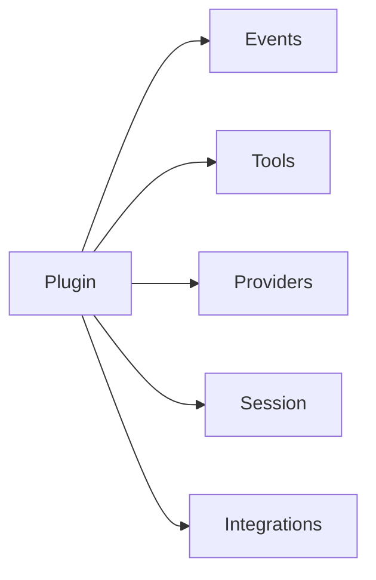

# OpenCode：Agent 框架与源码架构调研

> 调研时间：2026-08-15
> 当前官方仓库：`anomalyco/opencode`
> 定位：产品化程度很高的开源 coding-agent 平台
> 关键词：Client/Server、Session、Primary Agent、Subagent、Tool Registry、Permission、MCP、LSP、SDK

## 1. 一句话结论

OpenCode 已经不是“一个 Agent Loop + TUI”，更接近：

> **本地 Agent Server + 多种客户端 + Session Runtime + Agent / Tool / Permission / Plugin 系统。**

当前官方仓库是：

```text
github.com/anomalyco/opencode
```

源码主体是 TypeScript / Bun monorepo；当前开发分支还大量使用 Effect / Layer 风格做 service composition。

如果你想学“怎么把 coding agent 做成真正的软件平台”，OpenCode 比 Pi 更值得深挖。

---

## 2. 最关键的架构：TUI 是 Client

官方 Server 文档明确说明：

```text
opencode
```

启动时会有：

```text
TUI Client
    ↓
OpenCode Server
    ↓
Session Runtime
    ↓
Agent
    ↓
LLM + Tools + MCP + LSP
```

Server 暴露 OpenAPI 3.1 接口，SDK 和 IDE 集成也围绕这一层工作。



这是一个非常产品化的边界：Runtime 不属于某个 UI。

---

## 3. Primary Agent 与 Subagent

OpenCode 把 Agent 分成两类。

### Primary Agent

#### `build`

默认开发 Agent：

- 完整工具能力
- 能编辑文件
- 能执行 shell

#### `plan`

规划 / 分析 Agent：

- 默认限制文件修改
- bash 和编辑行为受 permission 控制
- 用于探索和制定方案

### Subagent

当前内置代表包括：

#### `general`

通用多步骤子 Agent，可以处理复杂任务。

#### `explore`

偏只读代码探索：

- glob
- grep
- read
- codebase navigation

#### `scout`

偏外部依赖和 upstream research，例如：

- clone dependency
- 看第三方库源码
- 对比本地实现与 upstream

---

## 4. Hidden System Agents

OpenCode 还内置了用户平时不直接选择的系统 Agent：

- compaction
- title
- summary

这透露出一个很重要的设计：

> **不是所有 LLM 调用都应该交给“主 Agent”。**

你完全可以把系统职责拆成：

```text
Coding Agent
Compaction Agent
Title Agent
Summary Agent
Explore Agent
Review Agent
```

共用同一套底层 runtime，但各自职责不同。

---

## 5. Subagent ≠ 普通 Prompt

OpenCode 的 subagent 有真正的 Agent 配置：

- mode
- model
- prompt
- tools
- permissions
- description

主 Agent 通过 task delegation 创建 child session。

概念上：



这比“再调一次模型”强很多，因为 child 有独立 history 和可观察执行轨迹。

---

## 6. Session Prompt：编排中心

值得直接看的源码：

```text
packages/opencode/src/session/prompt.ts
```

里面会汇聚：

- Agent
- Provider
- ToolRegistry
- Permission
- MCP
- LSP
- SystemPrompt
- Instruction
- Compaction
- Session state
- Tool execution
- Runtime flags

真正一次模型请求更像：

```text
当前 session
+ 当前 agent
+ 当前 model
+ system prompt
+ project instructions
+ skills
+ MCP instructions
+ visible tools
+ permission policy
+ history
+ runtime state
-----------------------------
最终 LLM request
```

现代 Agent Harness 最核心的能力之一，其实就是 **Context Assembly**。

---

## 7. Tool Registry

关键源码：

```text
packages/opencode/src/tool/registry.ts
```

它不只是一个 `Map<string, Tool>`，还处理：

- built-in tools
- custom JS/TS tools
- plugin tools
- task / subagent tool
- skill tool
- web search / fetch
- LSP
- MCP
- permission filtering
- output truncation
- model-specific tool selection
- experimental code mode

常见 built-in tool 包括：

```text
shell
read
glob
grep
edit
write
task
webfetch
todo
websearch
skill
apply_patch
question
lsp
```

---

## 8. Model-specific Tool Interface

OpenCode 会根据模型决定最终暴露的工具。

例如某些 GPT 类模型可能优先使用：

```text
apply_patch
```

而其他模型使用：

```text
edit / write
```

这是一个非常重要的工程经验：

> **不同模型不一定应该看到同一套 Tool API。**

成熟 Harness 的模型适配应该包括：

```text
API Adapter
Prompt Adapter
Tool Adapter
```

而不只是换 base_url。

---

## 9. Permission System

OpenCode 把 permission 做成一等运行时能力。

典型动作：

```text
allow
deny
ask
```

还可以按 capability / pattern 配置。

因此完整链路更像：

```text
Agent
  ↓
Tool Visibility
  ↓
Tool Invocation
  ↓
Permission Evaluation
  ↓
allow / deny / ask
```

而不是“模型想执行什么都执行，只在 UI 弹个框”。

这对 shell、file edit、MCP 等高权限工具非常重要。

---

## 10. Skills

OpenCode 支持 `SKILL.md`，并兼容多个约定目录，例如：

```text
.opencode/skills/
~/.config/opencode/skills/
.claude/skills/
~/.claude/skills/
.agents/skills/
~/.agents/skills/
```

Agent 初始只看到技能概要，需要时通过 `skill` tool 加载完整内容。

这也是 progressive disclosure：

```text
发现 Skill
  ↓
任务命中
  ↓
加载完整 SKILL.md
```

---

## 11. Rules / Instructions

OpenCode 支持：

- `AGENTS.md`
- `CLAUDE.md` fallback
- global instructions
- 自定义 instruction files
- remote instruction URLs

因此最终 context 可以分成：

```text
Base System Prompt
+ Environment
+ Project Rules
+ Global Rules
+ Skills
+ MCP Instructions
+ Session History
```

---

## 12. Model-specific System Prompt

关键源码：

```text
packages/opencode/src/session/system.ts
packages/opencode/src/session/prompt/
```

OpenCode 会针对不同模型选择不同 prompt，例如：

- Claude
- GPT / Codex
- Gemini
- Kimi
- Meta 等

原因很简单：

- Tool-use 风格不同
- Reasoning 行为不同
- Prompt 敏感度不同
- 编辑 API 偏好不同

这也是产品级 Agent 必然走向。

---

## 13. MCP 与 LSP

### MCP

把外部服务统一成 Agent 工具。

### LSP

给 coding agent 提供语言级代码智能，例如：

- diagnostics
- symbols
- language-aware navigation
- code actions / language context

相比只会 `grep/cat` 的 Agent，LSP 更接近 IDE-native Agent。

---

## 14. 为什么 Client / Server 架构值得学

如果第一版产品写成：

```text
React UI
  ↓
直接调用 Agent class
```

以后往往会很痛苦。

OpenCode 选择：

```text
Client
  ↓
Server API
  ↓
Agent Runtime
```

优势：

- TUI / IDE / Desktop 共用 Runtime
- Session 生命周期不绑死 UI
- SDK 不复制 Agent 逻辑
- 更容易 remote / containerize
- 自动化和人类交互能共用一套接口

---

## 15. Plugins

Plugin 可以用于：

- lifecycle hooks
- custom tools
- 外部集成
- 修改默认行为

Tool Registry 还会扫描自定义 JS / TS 工具。

概念上：



---

## 16. 优点

- 产品架构完整
- Client / Server 分离非常值得借鉴
- Primary / Subagent / Hidden Agent 分层明确
- Permission 是 runtime 一等公民
- Tool Registry 同时处理模型、权限、插件、MCP、LSP
- 很适合研究“真实 coding agent 产品”

## 17. 缺点

- 比 Pi 难读很多
- 框架逻辑和产品逻辑混在大系统里
- 当前开发非常快，内部函数名和模块边界可能变化
- 需要额外理解 Effect / Layer 等服务组合方式

---

## 18. 推荐阅读顺序

1. 官方 Agents 文档：先理解 primary / subagent / hidden agent
2. Server 文档：理解为什么它是 client/server
3. `packages/opencode/src/session/prompt.ts`
4. `packages/opencode/src/tool/registry.ts`
5. `packages/opencode/src/session/system.ts`
6. 再看 MCP、LSP、permission、plugin

---

## 19. 最值得借鉴的三个设计

### 1. Runtime 与 UI 解耦

```text
Client → Server → Runtime
```

### 2. Subagent = Child Session

每个 child 有：

```text
自己的 context
自己的 history
自己的 permissions
自己的 tools
```

### 3. Tool Registry 是策略层

最终 tool set 由：

```text
Agent
+ Model
+ Provider
+ Permission
+ Runtime Flags
```

共同决定。

---

## 20. 总结

> **OpenCode 是这四个项目里最适合学习“如何把 Coding Agent 做成完整软件平台”的项目。**

Pi 教你最小骨架。

OpenCode 教你：

> 怎么让 TUI、IDE、Desktop、SDK 和 automation 共用一套 Agent Runtime。

## 官方资料

- https://opencode.ai/
- https://github.com/anomalyco/opencode
- https://opencode.ai/docs/agents/
- https://opencode.ai/docs/server/
- https://opencode.ai/docs/sdk/
- https://opencode.ai/docs/skills/
- https://opencode.ai/docs/plugins/
- https://opencode.ai/docs/rules/
- https://github.com/anomalyco/opencode/blob/dev/packages/opencode/src/session/prompt.ts
- https://github.com/anomalyco/opencode/blob/dev/packages/opencode/src/tool/registry.ts
- https://github.com/anomalyco/opencode/blob/dev/packages/opencode/src/session/system.ts
