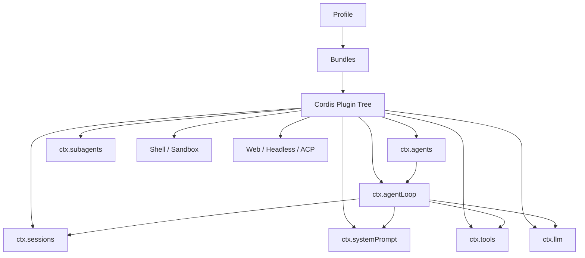
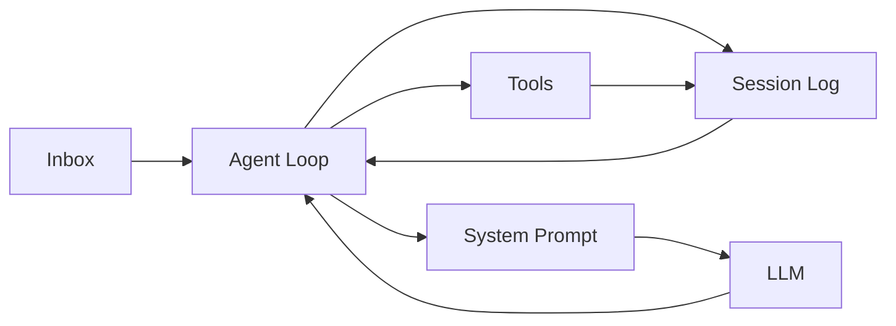
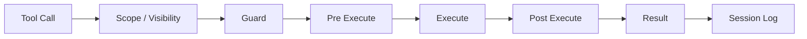
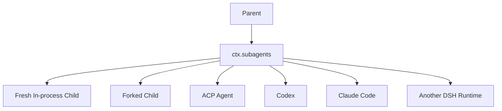

# DeepSeek Harness：架构与源码导读

> 调研时间：2026-08-15
> 官方项目：`deepseek-ai/deepseek-harness`
> 状态：Developer Preview，官方明确提示会有 breaking changes
> 核心理念：**Everything is a Plugin**
> 底层框架：Cordis

## 1. 一句话结论

DeepSeek Harness 是这四个项目里“框架味”最浓的。

Pi 是：

> primitives first。

DeepSeek Harness 更进一步：

> **连 Agent Loop 自己也只是插件 / service composition 的一部分。**

它把几乎所有能力拆成可替换模块：

- model adapter
- session
- system prompt
- tools
- agent
- agent loop
- shell
- sandbox
- subagent
- persistence
- permission
- telemetry
- UI

所以它更像一棵：

```text
Runtime Plugin / Service Graph
```

而不是一个固定 Agent 类。

---

## 2. Cordis：底层思想

DeepSeek Harness 建在 Cordis 上。

插件可以向共享 `ctx` 注册：

- services
- typed events
- reversible effects

典型服务包括：

```text
ctx.sessions
ctx.systemPrompt
ctx.tools
ctx.agents
ctx.agentLoop
ctx.llm
ctx.subagents
```

官方架构最关键的一句话是：

> 没有 privileged core。

也就是说扩展不是“围着一个不能动的核心打补丁”，而是可以通过 composition：

- 插入新能力
- 替换 provider
- 改变执行 policy
- 甚至替换默认 agent loop

---

## 3. 整体结构



它比传统 OOP Agent Runtime 更像依赖注入系统 + 事件总线 + capability registry。

---

## 4. Profiles、Bundles 与 Patch

DeepSeek Harness 的 Runtime 是在启动时组合出来的。

### Profile

完整运行配置，例如：

```text
web
headless
```

### Bundle

一组 Cordis 配置和代码能力。

### Patch

可以覆盖已有 composition row 或插入新的 row。

大概：

```text
base bundle
  ↓
profile bundles
  ↓
profile cordis.patch.yml
  ↓
home-level patch
  ↓
CLI --patch
```

可以用：

```bash
dsh --profile web --dump-config
```

观察实际启动出来的 plugin tree。

这非常像：

> Agent Runtime 的 declarative dependency graph。

---

## 5. Core Spine

官方 architecture 文档列出的关键组件：

| 包 | 职责 |
|---|---|
| `core/session` | append-only `SessionEvent` log |
| `core/system-prompt` | prompt sections + tool schemas assembly |
| `core/tools` | scoped tool registry + guarded execution |
| `core/agent` | Agent interface + registry + agent events |
| `core/agent-loop` | 默认 Agent driver |
| `core/scope` | per-agent scope primitive |
| `llm/llm` | message / stream vocabulary + LLM adapter seam |

数据流：



---

## 6. Session：事件源而不是普通 messages 数组

DSH 很强调：

> **Session log 是 durable source of truth。**

它更偏 append-only event log：

```text
turn/start
step/start
user/message
assistant/chunk
tool/...
...
```

而不是只维护：

```ts
messages: Message[]
```

好处：

- Replay
- Audit
- Telemetry
- Crash recovery
- 可以区分底层事实与模型可见 surface

现代长期运行 Agent 很适合 event-sourcing 思路。

---

## 7. Durable Event 与 Live Event 分离

DSH 把事件分成几类。

### Session Events

需要重启后仍保留的事实。

### Agent Events

`agent/*`，描述正在发生的运行状态：

- inbox
- status
- request
- validation
- continuation
- step

### Capability Events

例如：

```text
tools/*
fs/*
telemetry/*
```

用来给特定能力加 policy / interception。

这是非常清楚的控制面和数据面划分。

---

## 8. Turn / Step Lifecycle

官方 lifecycle 大体可以概括成：

```text
User followup
    ↓
Agent Inbox
    ↓
Driver wake
    ↓
turn/start
    ↓
claim queued input
    ↓
agent/pre-step waterfall
    ↓
step/start
    ↓
user/message
    ↓
system-prompt/assemble
    ↓
LLM request / stream
    ↓
tool calls
    ↓
tool execution
    ↓
tool results写入 session
    ↓
下一 step
```

### Turn

一次处理已经被接受的用户输入。

### Step

一次：

```text
LLM request
+
由本次 response 触发的 tools
```

因此一个 turn 内可以有多个 step。

---

## 9. Waterfall Hook

DSH 大量使用 waterfall interception，例如：

```text
agent/pre-step
system-prompt/assemble
tools/pre-execute
tools/post-execute
```

概念：

```text
输入
 ↓
Plugin A
 ↓
Plugin B
 ↓
Plugin C
 ↓
最终结果
```

这样 permission、sandbox、plan mode、telemetry 都可以挂在运行时 seam 上，而不是侵入 Agent Loop。

---

## 10. Tool Runtime

`ctx.tools` 不只是 registry，还包含完整执行管线：



适合挂载：

- permission
- sandbox
- timeout
- retry
- metrics
- plan-mode policy
- result transform

---

## 11. Scope：每个 Agent 有自己的能力视图

注册内容可以是：

```text
global
```

也可以只属于某个 Agent scope：

```text
Tool X → Agent A only
Prompt Section Y → Agent A only
```

官方还刻意避免简单的“父 scope 自动传给所有 child”，而是把 lineage 和 scope 分开，减少隐式继承导致的不可预测行为。

---

## 12. Subagent 是 Capability Seam

DeepSeek Harness 的 subagent 不属于核心 Agent Loop，而是 optional capability：

```text
ctx.subagents
```

可以注册多个 provider。

当前官方设计中可见的 provider 思路包括：

```text
spawn-in-process
fork-in-process
ACP
Codex
Claude Code
DeepSeek Harness SDK subprocess
```

这非常有意思：

> “Subagent” 不一定是同框架里的另一个 Agent。

它可以是：

```text
Codex
Claude Code
另一个 DSH runtime
任意 ACP agent
```

统一成 delegation abstraction。

---

## 13. Subagent 拓扑



这让 DeepSeek Harness 很像一个“Agent runtime bus”。

---

## 14. Code Mode

这是 DSH 很值得研究的一块。

传统 Tool Calling：

```text
LLM
 ↓
tool 1
 ↓
result
 ↓
LLM
 ↓
tool 2
 ↓
result
 ↓
LLM
```

多步骤任务会：

- 多次模型 round-trip
- 中间结果不断塞回 context
- branch / loop / join 都依赖模型一步步发 tool call

Code Mode 改成：

```text
LLM 写 TypeScript 程序
       ↓
run_code
       ↓
程序内部调用多个 tools
       ↓
只返回模型真正需要的结果
```

例如：

```ts
const files = await tools.glob({ pattern: "**/*.ts" })

const matched = []
for (const file of files) {
  const content = await tools.read({ path: file })
  if (content.includes("TODO")) matched.push(file)
}

return matched
```

循环、条件、并发和中间数据处理都可以在 code runtime 完成。

---

## 15. Code Mode 三种呈现

ToolRuntime 支持思路：

```text
native
code
both
```

### native

标准 JSON-schema tool call。

### code

主要暴露：

```text
run_code
+ 自动生成的 Tool SDK 类型
```

### both

简单调用直接 native，复杂多工具组合可以用 code。

这很可能代表未来 Harness 的一个重要方向：

> Tool Calling → Code-based Tool Orchestration。

---

## 16. Code Runtime 也是可替换 Seam

执行代码的 runtime 被单独抽象。

当前实现可用 Node worker thread；未来可以换：

```text
Python
Container
Remote Sandbox
VM
```

而 Tool Runtime 不需要重写。

这就是：

```text
Service Definition
  ↓
Provider
  ↓
Consumer
```

式的 capability seam。

---

## 17. 安全思路

官方明确说明 worker thread 不是硬安全边界。

需要更强隔离时应该换成：

```text
container backend
remote sandbox
VM
```

这一点反而很重要：

> 安全边界应该由真正的 isolation backend 提供，而不是靠 prompt 或假沙箱。

---

## 18. 优点

- 模块边界非常清楚
- Session event-sourcing 很适合 replay / audit
- Agent Loop 本身可替换
- Subagent provider abstraction 非常强
- Capability seam 非常适合做 runtime research
- Code Mode 很前沿

## 19. 缺点

- 学习成本高：Cordis、service、scope、seam、event、profile、bundle 都要理解
- Developer Preview，API 仍会破坏性变化
- 小项目机械照搬会过度工程化

---

## 20. 推荐阅读顺序

1. `README.md`
2. `docs/architecture.md`
3. `docs/agent-lifecycle.md`
4. `docs/subsystems/core.md`
5. `docs/subsystems/subagent.md`
6. `docs/cookbook/extension-cookbook.md`
7. Code Mode design note

---

## 21. 最值得借鉴的三个设计

### 1. Agent Loop 不是神圣核心

应用层依赖 Agent contract，而不是某个具体 loop 实现。

### 2. Durable Fact 与 Live Runtime Event 分开

```text
Session Event = 可 replay 的事实
Agent Event = 当前运行状态
```

### 3. Capability Seam

Shell、Subagent、Code Runtime、LLM 都可以通过：

```text
Definition → Provider → Consumer
```

解耦。

---

## 22. 总结

> **DeepSeek Harness 是这四个项目里最适合学习“Agent Runtime Framework 本身怎么设计”的项目。**

Pi 更简单，OpenCode 更产品化，Grok Build 更一体化，而 DSH 最像：

> 一个试图把 Agent Runtime 变成可组合系统软件的框架。

## 官方资料

- https://github.com/deepseek-ai/deepseek-harness
- https://github.com/deepseek-ai/deepseek-harness/blob/master/docs/architecture.md
- https://github.com/deepseek-ai/deepseek-harness/blob/master/docs/agent-lifecycle.md
- https://github.com/deepseek-ai/deepseek-harness/blob/master/docs/subsystems/core.md
- https://github.com/deepseek-ai/deepseek-harness/blob/master/docs/subsystems/subagent.md
- https://github.com/deepseek-ai/deepseek-harness/blob/master/packages/subagent/README.md
- https://github.com/deepseek-ai/deepseek-harness/blob/master/docs/cookbook/extension-cookbook.md
- https://github.com/deepseek-ai/deepseek-harness/blob/master/.agents/notes/implemented/feature/2026-06-15-code-mode.md
