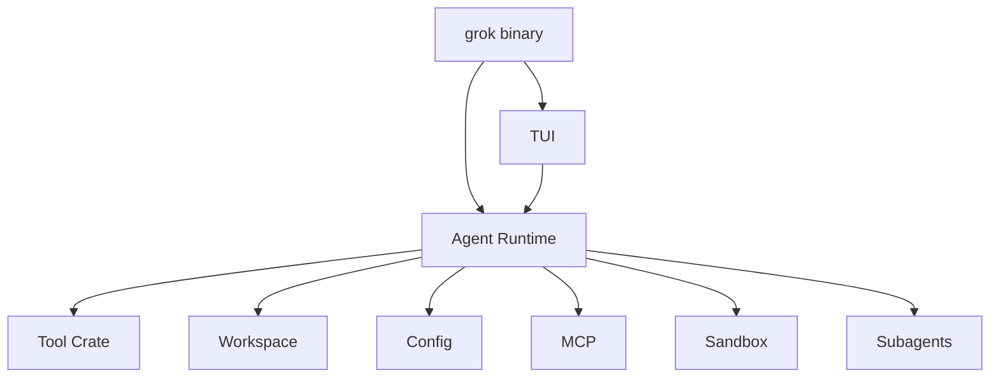
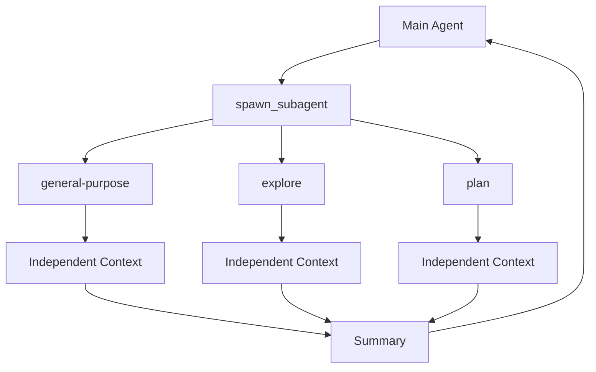

# Grok Build：Agent Harness 与源码架构调研

> 调研时间：2026-08-15
> 官方仓库：`xai-org/grok-build`
> 正式开源：2026-07-15
> 语言：Rust
> 定位：功能非常完整的 terminal coding-agent harness + TUI
> 关键词：Subagents、Plan Mode、Plugins、Hooks、MCP、Sandbox、Headless、ACP

## 1. 一句话结论

Grok Build 是这四个项目里最接近：

> **“一个成熟 Claude Code 类 Coding Agent 最终会长成什么样”**

的项目。

它已经不只是 Agent Loop，而是一整套开发 Agent Runtime：

- Full-screen TUI
- Agent Loop
- File / Shell / Web Tools
- Session
- Plan Mode
- Permission
- Sandbox
- Subagents
- Personas
- Skills
- Plugins
- Hooks
- MCP
- Headless
- ACP
- Memory
- Long-running workflows

而且核心是 Rust。

---

## 2. 开源范围

xAI 在 2026-07-15 宣布 Grok Build 开源，并明确提到公开了：

- agent loop
- context assembly
- tool-call dispatch
- code/file/search tools
- terminal UI
- plan review
- inline diff
- skills
- plugins
- hooks
- MCP
- subagents

因此这不是只公开一个 SDK，而是实际 Harness 代码。

---

## 3. Repository Layout

官方 README 给出的核心 crate：

| 路径 | 作用 |
|---|---|
| `xai-grok-pager-bin` | composition root / binary |
| `xai-grok-pager` | TUI |
| `xai-grok-shell` | Agent runtime、leader、stdio、headless |
| `xai-grok-tools` | terminal / file / search tools |
| `xai-grok-workspace` | filesystem / VCS / execution / checkpoints |
| 其他 crates | config / MCP / markdown / sandbox 等 |



---

## 4. Agent Runtime 主循环

基础闭环仍然是：

```text
User Prompt
   ↓
Context Assembly
   ↓
Model Inference
   ↓
Assistant
   ├─ text
   ├─ reasoning
   └─ tool calls
        ↓
     permission
        ↓
     tool execution
        ↓
     result
        ↓
     next model turn
```

真正复杂的是 loop 周围已经长出一整套系统：

```text
Session
Permission
Plan Mode
Sandbox
Plugins
Hooks
Subagents
MCP
Memory
Workflow
```

---

## 5. Headless Mode

Grok Build 原生支持：

```bash
grok -p "Fix this bug"
```

Headless 运行。

可控制：

- model
- cwd
- resume / continue session
- output format
- yolo
- tools allowlist
- disallowed tools
- max turns
- permission mode
- allow / deny
- sandbox

输出还可以是：

```text
plain
json
streaming-json
streaming-messages-json
```

所以它不仅是 TUI，也天然适合：

- CI
- scripting
- automation
- editor integration
- agent orchestration

---

## 6. Tool Filtering 与 Permission 分层

这是 Grok Build 一个非常值得抄的设计。

### Tool Filtering

决定：

> Agent 能不能看到这个工具。

例如：

```bash
--tools "read_file,grep,list_dir"
```

或：

```bash
--disallowed-tools "web_search,search_replace"
```

### Permission

工具仍然存在，但本次调用是否允许：

```bash
--allow "Bash(npm*)"
--deny "Bash(sudo*)"
```

完整链路：

```text
Tool Visibility
   ↓
Tool Call
   ↓
Permission Rule
   ↓
Execute / Ask / Deny
```

“工具是否存在”和“这一次是否允许”是两个不同问题。

---

## 7. Permission Rules

Grok 可以按 capability + glob 匹配：

```text
Bash(...)
Edit(...)
Write(...)
Read(...)
Grep(...)
WebFetch(...)
MCPTool(...)
```

例如：

```text
允许 npm*
拒绝 sudo*
允许读取整个 repo
只允许编辑 src/**
```

这比简单的全局 YOLO / Ask 模式细得多。

---

## 8. Sandbox

Grok Build 把 sandbox 作为真正 Runtime policy。

高权限 coding agent 的安全应该是：

```text
Tool Policy
+
Permission
+
Sandbox
```

而不是靠 system prompt 说：

```text
“请不要删除文件”
```

---

## 9. Subagents：原生 Child Session

Grok Build 默认支持 subagent。

官方定义的关键点：

- 独立 child session
- 独立 context window
- 独立 tool set
- 可选 persona
- 结束后把 summary 返回 parent

主 Agent 通过类似：

```text
spawn_subagent
```

的工具创建 child。



---

## 10. Built-in Agent Types

### `general-purpose`

完整能力的通用子 Agent。

### `explore`

研究 / 搜索型 Agent：

- read
- grep
- search
- shell
- 不编辑文件

### `plan`

探索代码并制定 implementation plan，不进行普通代码编辑。

---

## 11. 独立 Context 为什么重要

假设主 Agent 为了理解模块，执行：

```text
100 次搜索
50 个 read
30 个文件分析
```

全部留在主 context 会很浪费。

更好的模式：

```text
Parent:
“找到 authentication 的完整调用链”

Explore Child:
大量搜索 / 阅读

最终只返回：
- middleware 在哪里
- token refresh 在哪里
- test 在哪里
- 风险是什么
```

因此 subagent 本身就是一种：

> **Context Isolation + Context Compression。**

---

## 12. Agent 与 Persona 分层

Grok 区分：

### Agent

控制整个 session：

- model
- tools
- prompt mode
- system prompt
- skills

### Persona

给 subagent 增加行为 overlay：

- tone
- task focus
- output format
- input/output contract

例如：

```text
Agent = explore
Persona = security-reviewer
```

得到：

```text
只读研究能力
+
安全审计行为约束
```

比为每种任务创造一个全新 Agent 类型灵活。

---

## 13. Plan Mode 是 Runtime State

Grok 的 plan mode 不是一句 prompt，而是有运行状态。

Active 时：

- plan file 可以编辑
- 普通代码 edit 被 gate 拦截
- 退出 plan 后才真正 implementation

这非常重要：

> **重要行为约束应该由 Harness enforce，而不是靠模型“自觉”。**

---

## 14. Multi-Agent 里的权限继承问题

官方文档特意指出：

> parent 的 plan-mode edit gate 不会天然覆盖 subagent。

这暴露了 multi-agent 最容易忽略的问题：

```text
Parent 是只读
Child 却可能仍然可写
```

所以自己设计框架时必须明确：

- permission inheritance
- tool inheritance
- sandbox inheritance
- MCP inheritance
- plan state inheritance

不能默认 child 会自动继承 parent 的全部约束。

---

## 15. Plugins

Grok Plugin 已经很接近一个完整 Agent App Package。

一个 plugin 可以包含：

```text
skills/
commands/
agents/
hooks/hooks.json
.mcp.json
.lsp.json
plugin.json
```

也就是说一个插件可以同时提供：

- Skill
- Slash Command
- Agent
- Hook
- MCP
- LSP

这比“插件只注册 Tool”强很多。

---

## 16. Plugin Marketplace

插件来源可以是：

```text
GitHub repo
任意 git URL
本地目录
```

支持：

```bash
grok plugin install
grok plugin enable
grok plugin disable
grok plugin update
```

这说明 Grok Build 正在形成真正的 Agent Extension Ecosystem。

---

## 17. Enabled 与 Trusted 分离

Grok Plugin 的一个优秀安全设计：

> **enabled != trusted**

Plugin 可以被系统发现 / 启用，但涉及真正执行代码的：

- hooks
- MCP servers
- LSP servers

还需要 trust。

因此状态更像：

```text
Installed
  ↓
Enabled
  ↓
Trusted
  ↓
Executable Capability Active
```

这对 Agent 插件生态非常重要，因为插件本质上就是供应链执行代码。

---

## 18. MCP

Grok 原生支持 MCP，而且 Plugin 可以自带 `.mcp.json`。

真正复杂的地方不是“能不能加载 MCP”，而是：

- trust
- permission
- child inheritance
- per-agent visibility
- sandbox

成熟 Harness 一定要处理这些组合问题。

---

## 19. Hooks

Hooks 用于生命周期插入外部逻辑，可以用来做：

- audit
- telemetry
- policy
- lint
- notification
- integrations

Grok 把 hooks 和 plugin trust 放在一起，说明它清楚：

> Hook 是代码执行面，而不是普通 prompt 扩展。

---

## 20. Memory

当前 Grok Build 还提供 memory 相关命令，例如：

```text
/remember
/memory
/flush
/dream
```

可以理解成：

```text
Short-term Context
       +
Session History
       +
Long-term Memory
```

三层状态。

---

## 21. Workflows / Goals

Grok Build 还有更高层 autonomous workflow：

```text
Objective
Progress
Evidence
Verification
Completion Policy
```

这意味着“完成任务”不再只是模型说：

```text
Done.
```

而是可以引入独立 evidence review。

长任务 Agent 最终都会需要类似结构。

---

## 22. ACP

Grok Build 支持 Agent Client Protocol，可用于编辑器等外部客户端。

因此它的入口包括：

```text
TUI
Headless
Stdio
ACP
Editor embedding
```

这和 Pi 的 RPC / SDK、OpenCode 的 Server / SDK 属于同一趋势：

> **Agent Runtime 与 UI 分离。**

---

## 23. 优点

- 功能非常完整
- Rust 很适合研究长期运行、并发、process management
- Subagent / Permission / Sandbox 是一等公民
- Plugin Trust 模型很值得学
- Headless / automation 支持成熟
- 非常接近现代 coding-agent 产品的完整形态

## 24. 缺点

- 代码量大
- Rust 提高学习门槛
- 产品逻辑很多，只想看最小 loop 会被大量模块干扰
- 公开仓库是从 SpaceXAI monorepo 周期同步的源代码子集

---

## 25. 推荐阅读顺序

1. README / Repository Layout
2. Headless Mode
3. Subagents
4. Plugins
5. Plan Mode
6. Permissions / Safety
7. Configuration / Sandbox
8. 最后再进入 `xai-grok-shell` 源码

---

## 26. 最值得借鉴的三个设计

### 1. Tool Visibility 与 Permission 分层

```text
是否让模型看见工具
≠
是否允许这一次调用
```

### 2. Subagent = 独立 Session + Context

而不是普通一次模型调用。

### 3. Plugin Enabled 与 Trusted 分离

插件生态必须把“配置内容可见”和“第三方代码可执行”区分开。

---

## 27. 总结

> **Grok Build 是这四个项目里最适合研究“一个成熟 Coding Agent 产品最终会长成什么样”的项目。**

如果：

- Pi = 最小骨架
- DeepSeek Harness = 可组合 Agent Runtime
- OpenCode = Client/Server Agent 平台

那么：

> **Grok Build = 把 multi-agent、permission、sandbox、plugins、workflow 全部集成起来的 Agent Workstation。**

## 官方资料

- https://x.ai/news/grok-build-open-source
- https://x.ai/cli
- https://github.com/xai-org/grok-build
- https://github.com/xai-org/grok-build/blob/main/crates/codegen/xai-grok-pager/docs/user-guide/05-configuration.md
- https://github.com/xai-org/grok-build/blob/main/crates/codegen/xai-grok-pager/docs/user-guide/09-plugins.md
- https://github.com/xai-org/grok-build/blob/main/crates/codegen/xai-grok-pager/docs/user-guide/14-headless-mode.md
- https://github.com/xai-org/grok-build/blob/main/crates/codegen/xai-grok-pager/docs/user-guide/16-subagents.md
- https://github.com/xai-org/grok-build/blob/main/crates/codegen/xai-grok-pager/docs/user-guide/19-plan-mode.md
